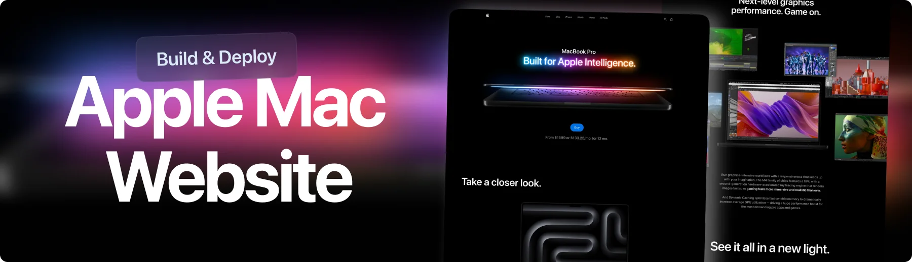

<div align="center">
  <br />
    <a href="https://github.com/Itssanthoshhere/Macbook-Landing-Page" target="_blank">
      
    </a>
  <br />

  <div>
    
    
    
    
    
    
  </div>

  <div align="center">
    <h3> MacBook Landing Page – Apple-Style 3D Product Showcase</h3>
    A <b>modern, immersive 3D website</b> built using <b>React, Three.js, GSAP, and TailwindCSS</b>.  
    Showcases Apple products with <b>realistic lighting, scroll-based animations, and masking effects</b> for an elegant, Apple-inspired experience.
  </div>
  <br />

  <a href="https://macbook-landing-page-ten.vercel.app/" target="_blank">
    
  </a>
</div>

---

## 📋 Table of Contents

1. ✨ [Introduction](#introduction)
2. ⚙️ [Tech Stack](#tech-stack)
3. 🔋 [Features](#features)
4. 🤸 [Quick Start](#quick-start)
5. 🧱 [Project Structure](#project-structure)
6. 🧠 [Architecture & Animations](#architecture--animations)
7. 🤝 [Contribution](#contribution)
8. 🔗 [Contacts](#contacts)
9. 📄 [License](#license)
10. 🙏 [Acknowledgements](#acknowledgements)

---

## ✨ Introduction

**Macbook Landing Page** is a high-end, **Apple-style 3D product website** built with cutting-edge web technologies like **React**, **GSAP**, **Three.js**, and **TailwindCSS**.

It features:

- **Immersive 3D visuals** powered by Three.js
- **Scroll-triggered GSAP animations**
- **Responsive, modern layout**
- **Cinematic transitions and masking effects**

The project is ideal for designers and developers aiming to build **interactive product showcases**, **tech landing pages**, or **portfolio experiences** with smooth animations and premium UI feel.

---

## ⚙️ Tech Stack

| Technology               | Purpose                                     |
| ------------------------ | ------------------------------------------- |
| **React.js**             | Component-based architecture for dynamic UI |
| **GSAP + ScrollTrigger** | Smooth, scroll-driven animations            |
| **Three.js**             | Realistic 3D rendering and lighting         |
| **TailwindCSS**          | Utility-first responsive styling            |
| **Zustand**              | Lightweight global state management         |
| **Vite**                 | Fast build tool and dev server              |
| **Hostinger**            | Hosting and deployment                      |
| **CodeRabbit**           | AI-powered code review integration          |

---

## 🔋 Features

- 💎 **Apple-Style Product Animation** — Showcase products with cinematic motion and scroll-sync effects
- ⚙️ **ScrollTrigger Timeline** — Multi-section animation synchronization powered by GSAP
- 🧩 **3D Model Integration** — Interactive Three.js scenes with realistic lighting and depth
- 🪄 **Image Masking & Reveal Effects** — Scroll-pinned masks for dynamic transitions
- 🖥️ **Responsive Layout** — Fully optimized for desktop, tablet, and mobile screens
- 🎨 **Customizable & Scalable** — Modular structure to add more sections or models easily
- ⚡ **Optimized Performance** — Smooth frame rates even with heavy animations

---

## 🤸 Quick Start

### Prerequisites

Ensure the following are installed:

- [Node.js](https://nodejs.org/)
- [Git](https://git-scm.com/)

### Clone the Repository

```bash
git clone https://github.com/Itssanthoshhere/Macbook-Landing-Page.git
cd Macbook-Landing-Page
```

````

### Install Dependencies

```bash
npm install
```

### Run the Development Server

```bash
npm run dev
```

Visit **[http://localhost:5173](http://localhost:5173)** to view the project locally.

---

## 🧱 Project Structure

| Folder/File        | Description                                        |
| ------------------ | -------------------------------------------------- |
| **src/components** | React components like Showcase, Navbar, Hero, etc. |
| **src/constants**  | Data files for sections and assets                 |
| **src/store**      | Zustand state management                           |
| **public/**        | Static assets – videos, images, and 3D models      |
| **vite.config.js** | Vite configuration for fast bundling               |
| **index.css**      | Global styles with TailwindCSS directives          |

---

## 🧠 Architecture & Animations

The **animation architecture** is powered by **GSAP** timelines with `ScrollTrigger` integration.
Key highlights:

- **Section-based triggers** for pinned scenes
- **Video + mask reveals** synchronized with scroll
- **Responsive animation breakpoints** via `useMediaQuery`
- **Optimized timeline flow** for performance

Each visual section (like “Showcase”, “Hero”, or “Performance”) has its own **animation sequence** and is controlled declaratively via React hooks.

---

## 🤝 Contribution

Contributions are always welcome!
To contribute:

1. Fork the repo
2. Create a new branch

   ```bash
   git checkout -b feature/my-feature
   ```

3. Make changes and commit

   ```bash
   git commit -m "feat: add my feature"
   ```

4. Push your branch

   ```bash
   git push origin feature/my-feature
   ```

5. Create a Pull Request 🎉

---

## 🔗 Contacts

- **GitHub:** [Itssanthoshhere](https://github.com/Itssanthoshhere)
- **LinkedIn:** [Santhosh VS](https://www.linkedin.com/in/thesanthoshvs/)

---

## 📄 License

This project is for **educational and portfolio purposes only**.
All rights to assets, logos, and trademarks belong to their respective owners.

---

## 🙏 Acknowledgements

- [JavaScript Mastery](https://www.youtube.com/@javascriptmastery) – for the tutorial reference
- [React](https://react.dev/) – for the component-based UI
- [GSAP](https://gsap.com/) – for scroll-driven motion
- [Three.js](https://threejs.org/) – for 3D rendering
- [TailwindCSS](https://tailwindcss.com/) – for utility styling

---

#### ⭐ Show Your Support

If you liked this project, **give it a ⭐ on GitHub** and share it with your network!

---
````
